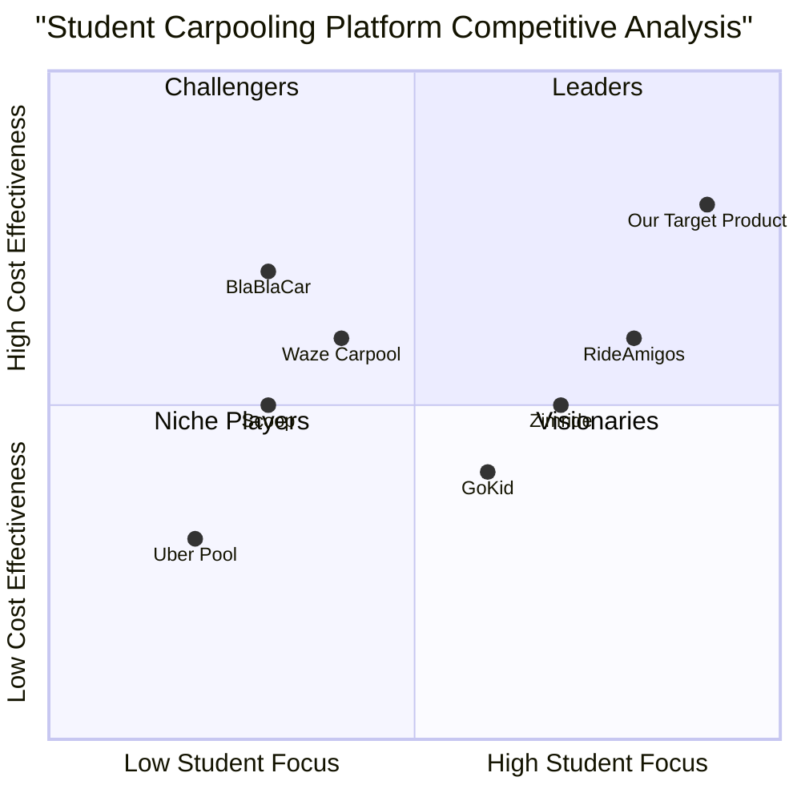

# Student Carpooling Web Application - Product Requirements Document (PRD)

## 1. Language & Project Information

**Language:** English  
**Programming Language:** TypeScript, React, Tailwind CSS, Shadcn-ui  
**Project Name:** student_carpooling_app  
**Original Requirements:** Create a comprehensive web application for student carpooling that addresses expensive and limited transportation options, enabling students to share rides from college to home or city destinations.

## 2. Product Definition

### 2.1 Product Goals

1. **Reduce Transportation Costs**: Enable students to share ride costs, reducing individual transportation expenses by 50-70% compared to traditional cab services.

2. **Improve Transportation Accessibility**: Connect students traveling to similar destinations, increasing ride availability and reducing waiting times for transportation.

3. **Build Campus Community**: Foster connections between students through safe, verified ride-sharing experiences that strengthen campus relationships.

### 2.2 User Stories

**As a student rider (without vehicle), I want to:**
- Post ride requests with specific destinations and departure times so that I can find affordable transportation options
- Search and filter available rides by location, time, and cost so that I can find rides that match my schedule and budget
- Book rides instantly and communicate with drivers so that I can secure reliable transportation
- Rate and review drivers so that I can help build a trustworthy community
- Receive notifications about new rides to my destination so that I don't miss transportation opportunities

**As a student driver (with vehicle), I want to:**
- Post ride offers with available seats and cost details so that I can share expenses and help fellow students
- View and manage ride requests from other students so that I can choose compatible passengers
- Accept or decline ride requests so that I maintain control over my vehicle capacity and passenger selection
- Receive payment contributions from riders so that I can offset fuel and maintenance costs
- Rate passengers so that I can contribute to community safety and reliability

**As a college administrator, I want to:**
- Ensure only verified students access the platform so that campus safety is maintained
- Monitor platform usage and safety metrics so that I can support student transportation needs

### 2.3 Competitive Analysis

Based on market research, here are the key competitors in the carpooling and ride-sharing space:

**1. BlaBlaCar**
- *Pros*: Established long-distance carpooling platform, strong verification system, integrated payment processing
- *Cons*: Primarily focused on intercity travel, not optimized for short college-to-city routes, complex pricing structure

**2. Uber Pool/Lyft Line (Discontinued)**
- *Pros*: Professional drivers, reliable service, integrated payment
- *Cons*: Expensive for students, discontinued shared ride options, not peer-to-peer

**3. Waze Carpool**
- *Pros*: Integration with navigation, cost-effective, peer-to-peer model
- *Cons*: Limited to commuter routes, not student-focused, requires smartphone app

**4. Scoop**
- *Pros*: Corporate carpooling focus, automated matching, workplace integration
- *Cons*: Enterprise-focused, not suitable for student demographics, limited geographic coverage

**5. GoKid**
- *Pros*: Safety-focused, community-based, parent verification
- *Cons*: Designed for families/children, not college students, limited scalability

**6. RideAmigos**
- *Pros*: University partnerships, student-focused features, event-based carpooling
- *Cons*: Limited market presence, basic user interface, restricted to partner institutions

**7. Zimride (by Enterprise)**
- *Pros*: University-focused, social networking integration, established campus presence
- *Cons*: Acquired and integrated into Enterprise, limited innovation, institutional focus

### 2.4 Competitive Quadrant Chart

## 3. Technical Specifications

### 3.1 Requirements Analysis

The student carpooling web application requires a comprehensive technical architecture that supports:

- **Real-time Communication**: WebSocket connections for instant messaging and live ride updates
- **Geolocation Services**: Integration with mapping APIs for route planning and location tracking
- **Authentication System**: Secure college email verification and user management
- **Payment Processing**: Cost splitting calculations and optional payment integration
- **Mobile-First Design**: Responsive web application optimized for mobile devices
- **Notification System**: Push notifications for ride updates and new opportunities
- **Data Security**: Protection of student personal information and ride data
- **Scalability**: Architecture supporting multiple colleges and growing user base

### 3.2 Requirements Pool

#### P0 (Must-Have) Requirements
- User registration and authentication via college email
- Ride posting functionality (offer and request)
- Basic ride search and filtering (destination, time, cost)
- User profile management with verification status
- In-app messaging system between matched users
- Ride booking and confirmation system
- Basic rating and review system
- Mobile-responsive web interface
- Data privacy and security compliance

#### P1 (Should-Have) Requirements
- Advanced search filters (vehicle type, gender preference, smoking policy)
- Real-time ride tracking and updates
- Automated cost splitting calculations
- Push notification system
- Ride history and analytics
- Emergency contact features
- Multi-college support
- Integration with popular mapping services
- Photo verification for enhanced safety

#### P2 (Nice-to-Have) Requirements
- Payment gateway integration
- Social media integration for enhanced profiles
- Ride scheduling for recurring trips
- Carbon footprint tracking
- Gamification elements (eco-friendly badges, frequent rider rewards)
- Integration with college event calendars
- Multi-language support
- Advanced analytics dashboard for administrators
- API for third-party integrations

### 3.3 UI Design Draft

#### 3.3.1 Core Layout Structure
- **Header**: Logo, user profile, notifications icon
- **Navigation**: Bottom tab navigation (Home, Search, My Rides, Messages, Profile)
- **Main Content Area**: Dynamic content based on selected tab
- **Footer**: Quick action buttons (Post Ride, Emergency Contact)

#### 3.3.2 Key Screens
1. **Authentication Screen**: College email input, verification code entry
2. **Dashboard**: Quick stats, recent rides, nearby ride opportunities
3. **Post Ride Screen**: Form with departure/arrival locations, time, seats, cost
4. **Search Results**: List view of available rides with filters
5. **Ride Details**: Comprehensive ride information, driver/rider profiles, booking options
6. **Messages**: Chat interface with ride participants
7. **Profile**: User information, verification status, ratings, ride history

#### 3.3.3 Mobile Optimization
- Touch-friendly interface with minimum 44px touch targets
- Swipe gestures for navigation between ride options
- Optimized forms with appropriate input types
- Compressed images and lazy loading for performance
- Offline capability for viewing booked rides

### 3.4 Open Questions

1. **Payment Integration**: Should the platform handle payments directly or rely on external payment methods (Venmo, cash)?
2. **Geographic Scope**: Should we start with a single college or launch with multiple institutions simultaneously?
3. **Vehicle Verification**: What level of vehicle documentation is required (insurance, registration)?
4. **Liability Concerns**: How will the platform address insurance and liability issues for peer-to-peer rides?
5. **Pricing Model**: Should the platform charge transaction fees, subscription fees, or remain free?
6. **Data Retention**: How long should ride history and user data be retained?
7. **Moderation**: What automated and manual moderation systems are needed for safety?
8. **Integration Requirements**: Should the platform integrate with existing college systems (student ID, campus security)?

## 4. Implementation Roadmap

### Phase 1: MVP Development (Months 1-3)
- Core authentication and user management
- Basic ride posting and search functionality
- Simple messaging system
- Mobile-responsive interface
- Single college pilot program

### Phase 2: Enhanced Features (Months 4-6)
- Advanced search and filtering
- Rating and review system
- Push notifications
- Multi-college expansion
- Safety features implementation

### Phase 3: Advanced Capabilities (Months 7-12)
- Payment integration
- Real-time tracking
- Analytics dashboard
- API development
- Third-party integrations

## 5. Success Metrics

### Primary KPIs
- **User Adoption**: Number of verified student registrations
- **Ride Completion Rate**: Percentage of booked rides successfully completed
- **Cost Savings**: Average cost reduction compared to traditional transportation
- **User Satisfaction**: Average rating scores and retention rates

### Secondary KPIs
- **Platform Engagement**: Daily/monthly active users
- **Safety Metrics**: Incident reports and resolution times
- **Geographic Expansion**: Number of colleges onboarded
- **Revenue Metrics**: Transaction volume and platform revenue (if applicable)

This PRD provides a comprehensive foundation for developing a student-focused carpooling web application that addresses the specific transportation challenges faced by college students while prioritizing safety, affordability, and community building.