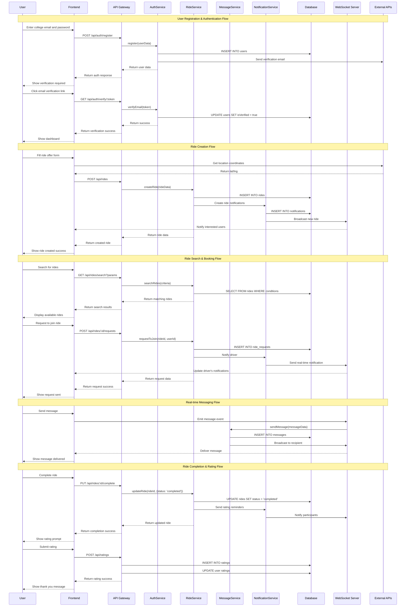

# Student Carpooling Web Application - System Design

## Implementation Approach

We will build a modern, scalable web application using React with TypeScript for the frontend and Node.js with Express for the backend. The system will prioritize real-time communication, mobile responsiveness, and security for student users.

**Key Technical Challenges & Solutions:**
- **Real-time Communication**: Implement Socket.IO for instant messaging and live ride updates
- **Mobile-First Design**: Use Tailwind CSS with responsive design patterns and PWA capabilities
- **Authentication Security**: Implement JWT-based authentication with college email verification
- **Scalability**: Use microservices architecture with Docker containers and cloud deployment
- **Location Services**: Integrate Google Maps API for route planning and real-time tracking
- **Cost Splitting**: Implement automated fare calculation algorithms with transparent pricing

**Technology Stack Selection:**
- **Frontend**: React 18 + TypeScript + Tailwind CSS + Shadcn-ui for modern, type-safe UI development
- **Backend**: Node.js + Express + TypeScript for consistent language across the stack
- **Database**: PostgreSQL for relational data + Redis for caching and session management
- **Real-time**: Socket.IO for WebSocket connections
- **Authentication**: JWT + Passport.js for secure authentication flows
- **File Storage**: AWS S3 for profile images and document uploads
- **Deployment**: Docker + AWS ECS for containerized, scalable deployment

## Data Structures and Interfaces

```mermaid
classDiagram
    class User {
        +id: string
        +email: string
        +firstName: string
        +lastName: string
        +phoneNumber: string
        +collegeId: string
        +profileImage: string
        +isVerified: boolean
        +verificationStatus: VerificationStatus
        +rating: number
        +totalRides: number
        +createdAt: Date
        +updatedAt: Date
        +__init__(email: string, firstName: string, lastName: string)
        +verifyEmail(): Promise<boolean>
        +updateProfile(data: UserUpdateData): Promise<User>
        +calculateRating(): number
    }

    class College {
        +id: string
        +name: string
        +domain: string
        +location: Location
        +isActive: boolean
        +createdAt: Date
        +__init__(name: string, domain: string, location: Location)
        +validateEmailDomain(email: string): boolean
    }

    class Ride {
        +id: string
        +driverId: string
        +type: RideType
        +fromLocation: Location
        +toLocation: Location
        +departureTime: Date
        +availableSeats: number
        +costPerSeat: number
        +description: string
        +status: RideStatus
        +vehicleInfo: VehicleInfo
        +preferences: RidePreferences
        +createdAt: Date
        +updatedAt: Date
        +__init__(driverId: string, type: RideType, fromLocation: Location, toLocation: Location)
        +updateStatus(status: RideStatus): Promise<void>
        +calculateTotalCost(): number
        +addPassenger(userId: string): Promise<boolean>
        +removePassenger(userId: string): Promise<boolean>
    }

    class RideRequest {
        +id: string
        +passengerId: string
        +rideId: string
        +status: RequestStatus
        +message: string
        +requestedSeats: number
        +createdAt: Date
        +updatedAt: Date
        +__init__(passengerId: string, rideId: string, requestedSeats: number)
        +approve(): Promise<void>
        +reject(reason: string): Promise<void>
    }

    class Message {
        +id: string
        +senderId: string
        +receiverId: string
        +rideId: string
        +content: string
        +messageType: MessageType
        +isRead: boolean
        +createdAt: Date
        +__init__(senderId: string, receiverId: string, content: string)
        +markAsRead(): Promise<void>
    }

    class Rating {
        +id: string
        +raterId: string
        +ratedUserId: string
        +rideId: string
        +score: number
        +comment: string
        +type: RatingType
        +createdAt: Date
        +__init__(raterId: string, ratedUserId: string, rideId: string, score: number)
    }

    class Notification {
        +id: string
        +userId: string
        +type: NotificationType
        +title: string
        +message: string
        +data: object
        +isRead: boolean
        +createdAt: Date
        +__init__(userId: string, type: NotificationType, title: string, message: string)
        +markAsRead(): Promise<void>
        +send(): Promise<void>
    }

    class Location {
        +latitude: number
        +longitude: number
        +address: string
        +city: string
        +state: string
        +zipCode: string
        +__init__(latitude: number, longitude: number, address: string)
        +calculateDistance(other: Location): number
    }

    class VehicleInfo {
        +make: string
        +model: string
        +year: number
        +color: string
        +licensePlate: string
        +__init__(make: string, model: string, year: number, color: string)
    }

    class AuthService {
        +register(userData: RegisterData): Promise<User>
        +login(email: string, password: string): Promise<AuthResponse>
        +verifyEmail(token: string): Promise<boolean>
        +refreshToken(refreshToken: string): Promise<string>
        +logout(userId: string): Promise<void>
    }

    class RideService {
        +createRide(rideData: CreateRideData): Promise<Ride>
        +searchRides(criteria: SearchCriteria): Promise<Ride[]>
        +getRideById(rideId: string): Promise<Ride>
        +updateRide(rideId: string, updateData: UpdateRideData): Promise<Ride>
        +deleteRide(rideId: string): Promise<void>
        +requestToJoin(rideId: string, passengerId: string): Promise<RideRequest>
    }

    class MessageService {
        +sendMessage(messageData: SendMessageData): Promise<Message>
        +getConversation(userId1: string, userId2: string, rideId: string): Promise<Message[]>
        +markMessagesAsRead(userId: string, conversationId: string): Promise<void>
    }

    class NotificationService {
        +createNotification(notificationData: CreateNotificationData): Promise<Notification>
        +getUserNotifications(userId: string): Promise<Notification[]>
        +markAsRead(notificationId: string): Promise<void>
        +sendPushNotification(userId: string, notification: Notification): Promise<void>
    }

    class PaymentService {
        +calculateRideCost(rideId: string): Promise<CostBreakdown>
        +splitCost(totalCost: number, passengers: string[]): Promise<CostSplit>
        +processPayment(paymentData: PaymentData): Promise<PaymentResult>
    }

    User ||--|| College : belongs_to
    User ||--o{ Ride : creates
    User ||--o{ RideRequest : makes
    User ||--o{ Message : sends
    User ||--o{ Rating : gives
    User ||--o{ Notification : receives
    Ride ||--o{ RideRequest : has
    Ride ||--|| Location : from_location
    Ride ||--|| Location : to_location
    Ride ||--|| VehicleInfo : has
    RideRequest ||--|| Ride : for
    Message ||--|| Ride : about
    Rating ||--|| Ride : for
```

## Program Call Flow



## Anything UNCLEAR

Several aspects need clarification for optimal implementation:

1. **Payment Integration Scope**: The PRD mentions cost splitting but doesn't specify if actual payment processing is required or if it's just calculation-based for manual payments.

2. **College Verification Process**: Need details on how college email domains will be validated and maintained, and whether integration with college IT systems is required.

3. **Liability and Insurance**: Legal framework for peer-to-peer ride sharing needs clarification, especially regarding platform liability and required insurance coverage.

4. **Geographic Expansion Strategy**: Whether the system should be designed for single-college deployment initially or multi-tenant architecture from the start.

5. **Real-time Location Tracking**: Level of location tracking required during rides and privacy implications for users.

6. **Content Moderation**: Automated and manual moderation requirements for user-generated content and safety monitoring.

7. **Data Retention Policies**: Specific requirements for how long user data, ride history, and messages should be retained.

8. **Emergency Procedures**: Integration requirements with campus security or emergency services for incident handling.